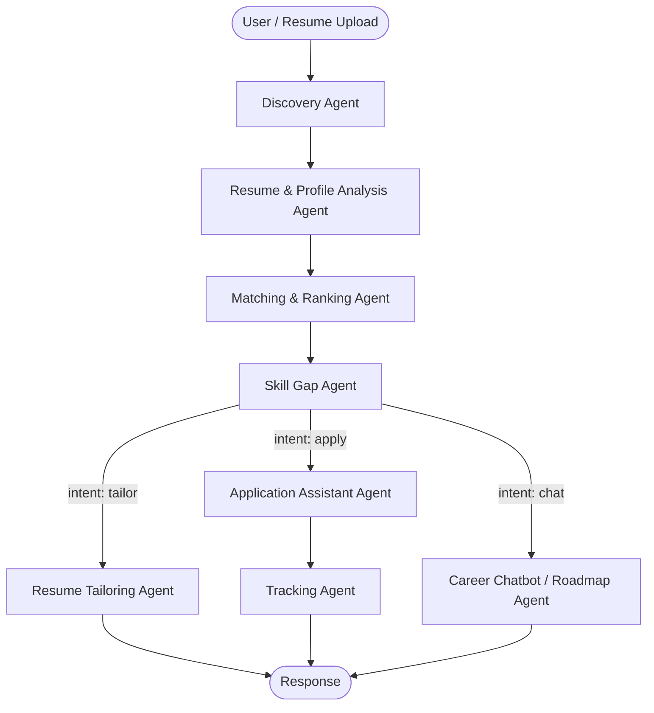

<div align="center">

# 🚀 ScoutSphere

**A $0 Multi-Agent AI Career Assistant Platform**

Autonomously discovers internships, hackathons, and jobs — then analyzes fit, tailors your resume, drafts applications, and coaches you through the gap, end to end.

[](https://www.python.org/)
[](https://fastapi.tiangolo.com/)
[](https://langchain-ai.github.io/langgraph/)
[](https://react.dev/)
[](https://www.postgresql.org/)
[]()

</div>

---

## What is ScoutSphere?

ScoutSphere is an **8-agent LangGraph pipeline** wrapped in a FastAPI + React monorepo. A student uploads a resume once, and the system takes it from there: it discovers relevant opportunities, scores fit with vector similarity, surfaces skill gaps with a learning plan, tailors resumes per-opportunity, drafts cover letters and portal answers, tracks the application through its lifecycle, and answers career questions through a RAG-powered chatbot — all on free-tier infrastructure.

## Table of Contents
- [Agent Pipeline](#-agent-pipeline)
- [Tech Stack](#-tech-stack)
- [Repository Structure](#-repository-structure)
- [Getting Started](#-getting-started)
- [Testing & Quality](#-testing--quality)
- [API Surface](#-api-surface)
- [Development Timeline](#-development-timeline)
- [Documentation](#-documentation)

---

## 🧠 Agent Pipeline

Eight specialized agents run as nodes in a single stateful **LangGraph** graph, sharing one `ScoutSphereState` object as they hand off work.



| # | Agent | Responsibility |
|---|-------|-----------------|
| 1 | **Discovery** | Pulls & normalizes listings from job/internship/hackathon sources, deduplicates, runs on a Celery beat schedule |
| 2 | **Resume & Profile Analysis** | Parses uploaded PDFs, extracts structured profile + skills, generates embeddings |
| 3 | **Matching & Ranking** | Hybrid scoring — pgvector cosine similarity + LLM top-20 re-ranking pass |
| 4 | **Skill Gap** | Diffs required vs. held skills, computes impact score, recommends validated learning resources |
| 5 | **Resume Tailoring** | Rewrites resume per-opportunity with a FactChecker anti-fabrication pass + ATS score estimate |
| 6 | **Application Assistant** | Drafts cover letters and portal form-field answers |
| 7 | **Tracking** | Manages the application status state machine, Kanban grouping, and stale-application nudges |
| 8 | **Career Chatbot / Roadmap** | RAG-powered Q&A over resumes/opportunities, generates multi-step career roadmaps |

An **Orchestrator/Router** inspects `current_intent` after the core analysis pipeline (Discovery → Analysis → Matching → Skill Gap) and conditionally branches into tailoring, application, or chat sub-graphs.

---

## 🛠️ Tech Stack

Every layer is chosen to keep the cost floor at **$0** while staying production-shaped.

<table>
<tr><td><b>Backend</b></td><td>Python 3.13 · FastAPI · Pydantic v2 · SQLAlchemy 2.0 (async) · Alembic</td></tr>
<tr><td><b>Agents</b></td><td>LangGraph (stateful multi-agent graphs) · LangChain Core</td></tr>
<tr><td><b>LLM Provider Chain</b></td><td>Unified <code>LLMClient</code> with automatic fallback: Gemini Flash → Groq (Llama/Qwen) → OpenRouter → local Ollama</td></tr>
<tr><td><b>Database & Vectors</b></td><td>PostgreSQL 17 + <code>pgvector</code>, HNSW cosine-distance index for similarity search</td></tr>
<tr><td><b>Task Queue</b></td><td>Celery + Redis (periodic discovery jobs, background processing)</td></tr>
<tr><td><b>Frontend</b></td><td>React 19 · TypeScript · Vite · Tailwind CSS · TanStack Query</td></tr>
<tr><td><b>Auth & Security</b></td><td>JWT (access + refresh tokens), Argon2 password hashing, prompt-injection input sanitization, sliding-window rate limiting, upload virus-scan hook</td></tr>
<tr><td><b>Infra</b></td><td>Docker Compose (db, redis, backend, worker, frontend)</td></tr>
</table>

---

## 📂 Repository Structure

```
ScoutSphere/
├── backend/
│   ├── app/
│   │   ├── agents/          # LangGraph orchestrator, 8 agent nodes, prompts, tools, shared state
│   │   ├── api/v1/          # REST endpoints (auth, users, resumes, opportunities, matches, ...)
│   │   ├── core/            # Config, DB session, LLM client, security, middleware, logging
│   │   ├── models/          # SQLAlchemy ORM models (14 tables)
│   │   ├── repositories/    # Async repository pattern over each model
│   │   ├── schemas/         # Pydantic request/response schemas
│   │   ├── services/        # Discovery, matching, skill-gap, tailoring, RAG, ATS analysis, tracking
│   │   ├── scripts/         # DB seeding scripts
│   │   └── worker/          # Celery app & periodic tasks
│   ├── alembic/              # DB migrations
│   └── tests/                 # 23 pytest modules (agents, auth, hardening, groundedness, full pipeline)
├── frontend/
│   └── src/
│       ├── components/       # 9 page/flow components (dashboard, chatbot, tracker, settings, ...)
│       ├── context/           # Auth context
│       └── api/                 # Typed API client
├── infra/
│   ├── docker-compose.yml
│   └── docker/                 # Per-service Dockerfiles
├── docs/
│   ├── architecture.md        # Full agent design + shared state schema
│   ├── erd.md                    # Database entity-relationship diagram
│   ├── api-spec.md              # REST API specification
│   ├── audit-report.md
│   └── adr/                       # Architecture decision records
├── .env.example
└── CHANGELOG.md               # Phase-by-phase release log
```

---

## 🚀 Getting Started

### Prerequisites
- Docker & Docker Compose
- (Optional, for local dev outside Docker) Python 3.13+ and Node.js 20+

### 1. Configure environment
```bash
cp .env.example .env
```
Fill in free-tier API keys (`GEMINI_API_KEY`, `GROQ_API_KEY`, `OPENROUTER_API_KEY`) or leave blank to fall back to local Ollama / stubs.

### 2. Launch the full stack
```bash
docker compose -f infra/docker-compose.yml up -d --build
```
This brings up PostgreSQL 17 + pgvector, Redis, the FastAPI backend, the Celery worker, and the React frontend.

### 3. Verify services

| Service | URL |
|---|---|
| React Frontend | http://localhost:5173 |
| FastAPI Health Check | http://localhost:8000/api/v1/health |
| Interactive Swagger Docs | http://localhost:8000/docs |

---

## 🧪 Testing & Quality

```bash
# Backend test suite (23 modules — agents, auth, hardening, full pipeline)
cd backend
pytest -v

# Linting & static analysis
ruff check backend/
black --check backend/
mypy backend/

# Frontend linting
cd frontend
npm run lint
```

Backend hardening is covered explicitly by `test_hardening_security.py` (prompt-injection defense, upload limits, virus-scan rejection), and agent output faithfulness by `test_agent_groundedness.py` / `test_copilot_groundedness.py`.

---

## 🔌 API Surface

All routes are versioned under `/api/v1`:

| Prefix | Covers |
|---|---|
| `/auth` | JWT login, refresh, registration, audit log |
| `/users` | Profile & user-skill management |
| `/resumes` | Upload, parsing, ATS analysis |
| `/opportunities` | Discovered listings |
| `/matches` | Ranked opportunity matches |
| `/skill-gaps` | Gap analysis & learning recommendations |
| `/applications` | Tailoring, cover letters, lifecycle tracking |
| `/chat` | Career chatbot / RAG Q&A |
| `/roadmap` | Generated career roadmaps |
| `/settings` | User preferences |

Full request/response contracts live in [`docs/api-spec.md`](docs/api-spec.md).

---

## 📅 Development Timeline

Built in 15 incremental phases, each shipped with its own tests:

| Phase | Milestone |
|---|---|
| 1 | Architecture blueprint, ERD, API spec, ADRs |
| 2 | Monorepo skeleton & Docker infra |
| 3 | SQLAlchemy models & async repository pattern |
| 4 | JWT auth system & profile management |
| 5 | Provider-agnostic `LLMClient`, Resume Analysis Agent, ~200-skill taxonomy |
| 6 | Discovery Agent (3 sources, dedup, Celery beat) |
| 7 | Hybrid matching engine + LLM re-ranking |
| 8 | Skill Gap Agent |
| 9 | Resume Tailoring Agent + FactChecker + ATS scoring |
| 10 | Application Assistant Agent |
| 11 | Application lifecycle state machine + Kanban dashboard |
| 12 | Career Chatbot & Roadmap Agent (RAG + streaming) |
| 13 | Master LangGraph orchestrator + observability |
| 14 | Full React 19 frontend (9 flows) |
| 15 | Security hardening — prompt-injection guardrails, rate limiting, HNSW indexing |

Full details in [`CHANGELOG.md`](CHANGELOG.md).

---

## 📖 Documentation

- [`docs/architecture.md`](docs/architecture.md) — Multi-agent architecture blueprint & shared state schema
- [`docs/erd.md`](docs/erd.md) — Database ERD & schema spec
- [`docs/api-spec.md`](docs/api-spec.md) — REST API specification
- [`docs/adr/001-langgraph-over-function-calling.md`](docs/adr/001-langgraph-over-function-calling.md) — Why LangGraph
- [`docs/adr/002-pgvector-over-separate-vectordb.md`](docs/adr/002-pgvector-over-separate-vectordb.md) — Why pgvector
- [`docs/adr/003-resume-parsing-approach.md`](docs/adr/003-resume-parsing-approach.md) — Hybrid resume parsing approach

---

<div align="center">

Built as a solo capstone project — a multi-agent system designed from the ground up to run entirely on free-tier infrastructure.

</div>