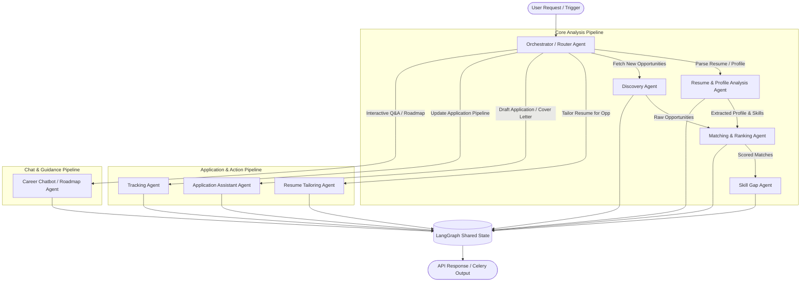
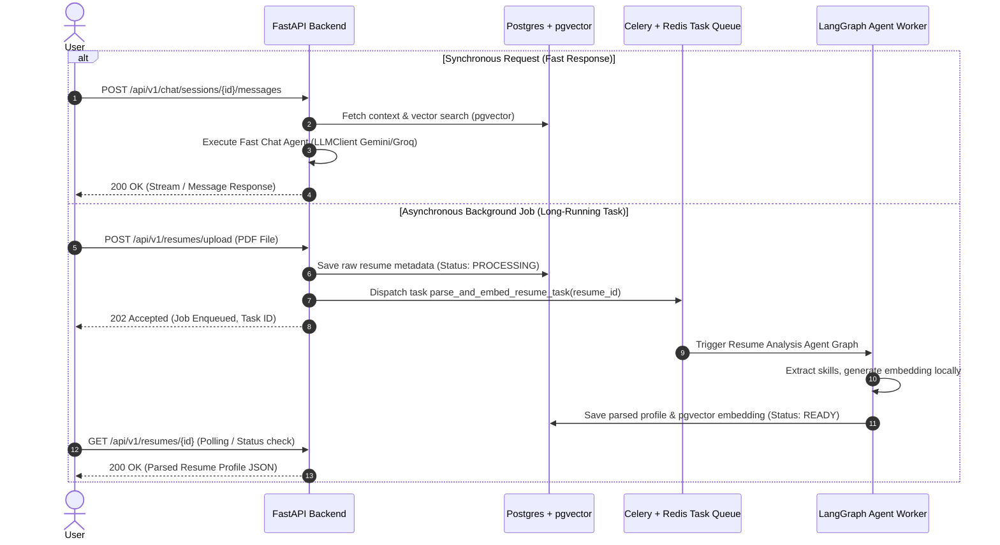

# ScoutSphere - System Architecture & Agent Design

## Overview
**ScoutSphere** is an autonomous, multi-agent AI career assistant platform designed to help students and job-seekers discover relevant internships, hackathons, and jobs; analyze skill fit; bridge career skill gaps; generate ATS-optimized resumes; draft tailored job applications; and interact via a personalized RAG-powered career roadmap chatbot.

---

## 1. Multi-Agent Orchestration Architecture (LangGraph)

ScoutSphere orchestrates agents as stateful nodes within a **LangGraph** execution graph. A central `Orchestrator / Router Agent` inspects incoming user intents, inspects task state, and dispatches execution to domain-specific agents sequentially or in parallel.



### Agent Roles & Description

| Agent Name | Description | Inputs | Outputs | Primary LLM Role |
| :--- | :--- | :--- | :--- | :--- |
| **Orchestrator / Router Agent** | Evaluates user input, classifies intent, chooses agent path, routes graph state. | User Request, Current State | Next Node Name, Routing Instructions | Intent classification, routing decision |
| **Discovery Agent** | Scrapes / queries job, internship, hackathon sources & APIs. Normalizes raw listings. | Target Keywords, Locations, Types | Raw Opportunities List | Field normalization, metadata tagging |
| **Resume & Profile Analysis Agent** | Parses resume PDFs, extracts work experience, education, skills, projects, and generates profile embeddings. | Raw Resume Text / PDF Bytes | Structured Resume Schema, Skill Tokens, Vector Embedding | Structural JSON extraction, skill extraction |
| **Matching & Ranking Agent** | Calculates vector similarity (pgvector) and hybrid matching scores between profile and opportunities. | User Profile Vector, Opportunity Vectors | Match Scores, Fit Breakdown, Overlap Summary | Matching explanation & re-ranking |
| **Skill Gap Agent** | Compares user skills against required opportunity skills; produces actionable learning paths. | User Skills, Opportunity Requirements | Missing Skills List, Impact Score, Recommended Resources | Gap analysis, study plan generation |
| **Resume Tailoring Agent** | Takes base resume and specific opportunity details to generate an ATS-optimized, targeted resume draft. | Base Resume JSON, Target Opportunity JSON | Tailored Resume Draft (JSON/Markdown) | Content re-phrasing, keyword injection |
| **Application Assistant Agent** | Drafts customized cover letters, answers custom portal questions, and prepares auto-fill fields. | User Profile, Target Opportunity, User Preferences | Cover Letter Text, Form Field Answers | Contextual writing, Q&A drafting |
| **Tracking Agent** | Updates application status pipeline, records notes, logs status transition timestamps. | Application ID, New Status, Notes | Updated Application Model, History Log | Pipeline rule enforcement |
| **Career Chatbot / Roadmap Agent**| RAG-powered Q&A answering student career questions; synthesizes multi-step career roadmaps. | User Query, RAG Context (Resumes/Opps), Target Role | Answer Stream, Milestone Roadmap Nodes | RAG synthesis, career planning |

---

## 2. Shared State Schema (`ScoutSphereState`)

All agents communicate via a unified, stateful object passed through the LangGraph execution flow.

```python
from typing import TypedDict, Annotated, List, Dict, Any, Optional
import operator

class ScoutSphereState(TypedDict):
    """Unified state container for ScoutSphere LangGraph multi-agent workflow."""
    
    # Session & User Identifiers
    user_id: str
    session_id: str
    current_intent: Optional[str]
    
    # Profile & Resume Context
    raw_resume_text: Optional[str]
    parsed_profile: Optional[Dict[str, Any]]
    profile_embedding: Optional[List[float]]
    
    # Discovery & Opportunities
    search_filters: Optional[Dict[str, Any]]
    raw_opportunities: Optional[List[Dict[str, Any]]]
    
    # Matching & Gap Analysis
    target_opportunity_id: Optional[str]
    matches: Optional[List[Dict[str, Any]]]
    skill_gap_analysis: Optional[Dict[str, Any]]
    
    # Application & Artifact Generation
    tailored_resume: Optional[Dict[str, Any]]
    application_draft: Optional[Dict[str, Any]]
    
    # Chat & Roadmap Context
    chat_query: Optional[str]
    chat_history: Annotated[List[Dict[str, str]], operator.add]
    rag_context: Optional[List[Dict[str, Any]]]
    roadmap_result: Optional[Dict[str, Any]]
    
    # Execution Tracking & Error Handling
    messages: Annotated[List[Dict[str, Any]], operator.add]
    errors: Annotated[List[Dict[str, Any]], operator.add]
    next_node: Optional[str]
```

---

## 3. Synchronous REST vs. Asynchronous Background Execution

To keep the platform fast and responsive under free-tier resource limits, long-running agent flows are delegated to **Celery worker queues with Redis**, while quick queries run synchronously via **FastAPI**.



### Execution Strategy Matrix

| Operation | Model | Reason | Execution Handler |
| :--- | :--- | :--- | :--- |
| **Auth & User Profile CRUD** | Synchronous | Direct DB access, sub-50ms latency | FastAPI + SQLAlchemy |
| **Opportunity Vector Search** | Synchronous | pgvector HNSW index lookup (< 30ms) | FastAPI + SQLAlchemy pgvector |
| **Resume Upload & Parsing** | Asynchronous | PDF parsing, multi-pass LLM extraction, local embedding generation | Celery + Redis Worker |
| **Multi-Source Opportunity Crawl** | Asynchronous | Web scraping / external API latency & rate limits | Celery + Redis Worker |
| **Batch Opportunity Matching** | Asynchronous | Multi-record scoring & re-ranking | Celery + Redis Worker |
| **Resume Tailoring & PDF Generation**| Asynchronous | Generative LLM refinement & PDF rendering | Celery + Redis Worker |
| **Application Cover Letter Drafting**| Synchronous / Stream | Immediate feedback in UI builder | FastAPI + LLMClient Stream |
| **Roadmap & RAG Q&A Chat** | Synchronous / Stream | Conversational user experience | FastAPI + LangGraph Chat |

---

## 4. Manual Testing Steps for Phase 1 Architecture Verification

## 5. External Opportunity Source Integrations & ToS Compliance

ScoutSphere utilizes a pluggable `OpportunitySource` interface (`fetch(query, filters) -> List[RawOpportunity]`). Adding new real-world integrations requires zero changes to core agent orchestration or database logic.

### 5.1 Environment Variable Configuration for Production APIs

To swap in live production sources, populate the following environment variables in `.env`:

| Source Name | Required Env Vars | Integration Pattern | Free Tier Details |
| :--- | :--- | :--- | :--- |
| **Adzuna Jobs API** | `ADZUNA_APP_ID`, `ADZUNA_APP_KEY` | Official REST API | 2,500 free calls/month for global job listings |
| **Devpost Hackathons** | `DEVPOST_RSS_URL` | Public RSS/XML Feed | 100% free public feed for global hackathons |
| **GitHub Open Jobs** | `GITHUB_JOBS_API_ENDPOINT` | Official Public API | Free open-source job endpoints |
| **USAJOBS Government**| `USAJOBS_API_KEY`, `USAJOBS_EMAIL` | Official REST API | Free US government internships & student jobs API |

### 5.2 Terms of Service (ToS) & Scraping Compliance Policy

1. **Official APIs & RSS Priority**: ScoutSphere prioritizes official REST APIs and standard RSS/Atom feeds.
2. **Robots.txt & Rate Limiting**: For public feed aggregators, crawlers must respect `robots.txt` rate limits, user-agent identification headers (`ScoutSphereBot/1.0`), and exponential backoff.
3. **Prohibited Sites**: Sites explicitly disallowing web scraping or automated data retrieval in their Terms of Service (e.g. LinkedIn) are strictly accessed via official developer partner APIs or excluded from web crawlers.

---

## 6. Application Assistant Boundaries & Auto-Submission Safety Policy

ScoutSphere's Application Assistant Agent is explicitly designed to output a **human-reviewable draft package** (customized cover letter text, pre-filled form fields, and tailored resume link).

### 6.1 Safety Boundary Principles

1. **No Unassisted External Submissions**: ScoutSphere does **NOT** auto-submit applications directly to external job portals or company websites without human review.
2. **Draft Review Package**: The candidate reviews, edits, and approves all drafted answers before copying them into external forms or clicking "Submit".
3. **Future Extension Requirements**: Direct automated browser form submission (e.g. via Playwright/Puppeteer browser agents) or API submission is isolated to a separate, high-risk extension phase requiring:
   - Explicit user per-application consent.
   - Credentials isolation & OAuth token scoping.
   - Comprehensive audit logging of submitted payload bytes.

---

## 7. Shared State Schema Field Ownership Contract

The master orchestrator manages a shared `ScoutSphereState` schema across all 9 agents. To maintain clean boundaries and prevent accidental state mutation, each specialized agent is assigned strict field ownership rules.

### 7.1 Field Ownership Contract Matrix

| Specialized Agent Node | Shared State Fields Read | Shared State Fields Written | Ownership Scope |
| :--- | :--- | :--- | :--- |
| **Discovery Agent** | `search_filters` | `discovered_opportunities` | Raw opportunity discovery & deduplication |
| **Resume Analysis Agent** | `raw_resume_text`, `user_profile` | `parsed_profile`, `profile_embedding` | Resume parsing & skill normalization |
| **Matching Agent** | `parsed_profile`, `discovered_opportunities` | `matches` | Vector similarity & hybrid ranking |
| **Skill Gap Agent** | `parsed_profile`, `discovered_opportunities` | `skill_gap_analysis` | Skill delta calculation & resource validation |
| **Resume Tailoring Agent**| `parsed_profile`, `target_opportunity_id` | `tailored_resume` | Bullet point rewriting & fact-checker diff |
| **Application Assistant** | `parsed_profile`, `target_opportunity_id` | `application_draft` | Cover letter drafting & form pre-fill |
| **Tracking Agent** | `application_draft` | `next_node` | Pipeline status state transitions |
| **Career Chatbot** | `chat_query`, `rag_context` | `chat_history` | Grounded RAG conversational Q&A |


