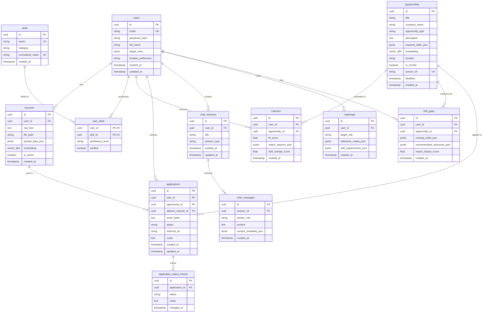

# ScoutSphere - Database ERD & Relational Schema Specification

## Overview
ScoutSphere uses **PostgreSQL 17** with the **pgvector** extension. All vector embeddings (384-dimensional for local `all-MiniLM-L6-v2` or Gemini embeddings) are stored directly inside PostgreSQL alongside relational user data.

---

## 1. Entity-Relationship Diagram (ERD)



---

## 2. Table Schemas & Constraints

### 2.1 `users`
Stores user profile credentials and career preference baselines.
- `id`: `UUID`, Primary Key, default `gen_random_uuid()`
- `email`: `VARCHAR(255)`, Unique, Not Null
- `password_hash`: `VARCHAR(255)`, Not Null (Argon2id hashed)
- `full_name`: `VARCHAR(255)`, Not Null
- `target_roles`: `JSONB`, Not Null, default `'[]'::jsonb` (e.g. `["Backend Engineer", "AI Developer"]`)
- `location_preference`: `VARCHAR(255)`
- `created_at`: `TIMESTAMPTZ`, Not Null, default `NOW()`
- `updated_at`: `TIMESTAMPTZ`, Not Null, default `NOW()`

### 2.2 `resumes`
Stores uploaded resume files, extracted structured data, and vector embeddings.
- `id`: `UUID`, Primary Key
- `user_id`: `UUID`, Foreign Key $\rightarrow$ `users(id)` ON DELETE CASCADE
- `raw_text`: `TEXT`, Not Null
- `file_path`: `VARCHAR(512)`
- `parsed_data_json`: `JSONB`, default `'{}'::jsonb` (Work experience, education, projects)
- `embedding`: `vector(384)`, Indexed via HNSW (`vector_cosine_ops`)
- `is_active`: `BOOLEAN`, Not Null, default `true`
- `created_at`: `TIMESTAMPTZ`, Not Null, default `NOW()`

### 2.3 `skills`
Master catalog of normalized skills.
- `id`: `UUID`, Primary Key
- `name`: `VARCHAR(100)`, Unique, Not Null
- `category`: `VARCHAR(100)` (e.g., "Languages", "Frameworks", "Cloud")
- `normalized_name`: `VARCHAR(100)`, Unique, Not Null (lowercase, stripped)
- `created_at`: `TIMESTAMPTZ`, Not Null, default `NOW()`

### 2.4 `user_skills`
Junction table linking users with skills and proficiency ratings.
- `user_id`: `UUID`, Foreign Key $\rightarrow$ `users(id)` ON DELETE CASCADE
- `skill_id`: `UUID`, Foreign Key $\rightarrow$ `skills(id)` ON DELETE CASCADE
- `proficiency_level`: `VARCHAR(50)` (e.g. "Beginner", "Intermediate", "Advanced")
- `verified`: `BOOLEAN`, Not Null, default `false`
- Primary Key: `(user_id, skill_id)`

### 2.5 `opportunities`
Jobs, internships, and hackathons aggregated from scrapers/APIs.
- `id`: `UUID`, Primary Key
- `title`: `VARCHAR(255)`, Not Null
- `company_name`: `VARCHAR(255)`, Not Null
- `opportunity_type`: `VARCHAR(50)`, Not Null (e.g. "JOB", "INTERNSHIP", "HACKATHON")
- `description`: `TEXT`, Not Null
- `required_skills_json`: `JSONB`, default `'[]'::jsonb`
- `embedding`: `vector(384)`, Indexed via HNSW (`vector_cosine_ops`)
- `location`: `VARCHAR(255)`
- `is_remote`: `BOOLEAN`, Not Null, default `false`
- `source_url`: `TEXT`, Unique, Not Null
- `deadline`: `TIMESTAMPTZ`
- `created_at`: `TIMESTAMPTZ`, Not Null, default `NOW()`

### 2.6 `matches`
Calculated fit score between a user and an opportunity.
- `id`: `UUID`, Primary Key
- `user_id`: `UUID`, Foreign Key $\rightarrow$ `users(id)` ON DELETE CASCADE
- `opportunity_id`: `UUID`, Foreign Key $\rightarrow$ `opportunities(id)` ON DELETE CASCADE
- `fit_score`: `FLOAT`, Not Null (0.00 to 1.00)
- `match_reasons_json`: `JSONB` (Breakdown of matching features)
- `skill_overlap_score`: `FLOAT` (0.00 to 1.00)
- `created_at`: `TIMESTAMPTZ`, Not Null, default `NOW()`
- Index: Unique `(user_id, opportunity_id)`

### 2.7 `skill_gaps`
Stores gap analysis for a specific user and opportunity pair.
- `id`: `UUID`, Primary Key
- `user_id`: `UUID`, Foreign Key $\rightarrow$ `users(id)` ON DELETE CASCADE
- `opportunity_id`: `UUID`, Foreign Key $\rightarrow$ `opportunities(id)` ON DELETE CASCADE
- `missing_skills_json`: `JSONB`, Not Null
- `recommended_resources_json`: `JSONB` (Links, courses, topics to learn)
- `match_impact_score`: `FLOAT` (Potential score boost if skills acquired)
- `created_at`: `TIMESTAMPTZ`, Not Null, default `NOW()`

### 2.8 `applications`
User job and hackathon application tracking pipeline state.
- `id`: `UUID`, Primary Key
- `user_id`: `UUID`, Foreign Key $\rightarrow$ `users(id)` ON DELETE CASCADE
- `opportunity_id`: `UUID`, Foreign Key $\rightarrow$ `opportunities(id)` ON DELETE CASCADE
- `tailored_resume_id`: `UUID`, Foreign Key $\rightarrow$ `resumes(id)` ON DELETE SET NULL
- `cover_letter`: `TEXT`
- `status`: `VARCHAR(50)`, Not Null (e.g. "SAVED", "APPLIED", "INTERVIEWING", "OFFER", "REJECTED")
- `external_url`: `TEXT`
- `notes`: `TEXT`
- `created_at`: `TIMESTAMPTZ`, Not Null, default `NOW()`
- `updated_at`: `TIMESTAMPTZ`, Not Null, default `NOW()`

### 2.9 `application_status_history`
Audit log of application status transitions over time.
- `id`: `UUID`, Primary Key
- `application_id`: `UUID`, Foreign Key $\rightarrow$ `applications(id)` ON DELETE CASCADE
- `status`: `VARCHAR(50)`, Not Null
- `notes`: `TEXT`
- `changed_at`: `TIMESTAMPTZ`, Not Null, default `NOW()`

### 2.10 `chat_sessions`
Conversational threads with the Career Chatbot / Roadmap agent.
- `id`: `UUID`, Primary Key
- `user_id`: `UUID`, Foreign Key $\rightarrow$ `users(id)` ON DELETE CASCADE
- `title`: `VARCHAR(255)`, Not Null
- `session_type`: `VARCHAR(50)`, default `"GENERAL"` (e.g. `"GENERAL"`, `"ROADMAP"`, `"INTERVIEW_PREP"`)
- `created_at`: `TIMESTAMPTZ`, Not Null, default `NOW()`
- `updated_at`: `TIMESTAMPTZ`, Not Null, default `NOW()`

### 2.11 `chat_messages`
Individual prompt and model messages within a chat session.
- `id`: `UUID`, Primary Key
- `session_id`: `UUID`, Foreign Key $\rightarrow$ `chat_sessions(id)` ON DELETE CASCADE
- `sender_role`: `VARCHAR(20)`, Not Null (e.g. `"user"`, `"assistant"`, `"system"`)
- `content`: `TEXT`, Not Null
- `context_metadata_json`: `JSONB` (Retrieved RAG chunks, opportunity references)
- `created_at`: `TIMESTAMPTZ`, Not Null, default `NOW()`

### 2.12 `roadmaps`
Generated step-by-step career path milestones.
- `id`: `UUID`, Primary Key
- `user_id`: `UUID`, Foreign Key $\rightarrow$ `users(id)` ON DELETE CASCADE
- `target_role`: `VARCHAR(255)`, Not Null
- `milestone_nodes_json`: `JSONB`, Not Null (Array of steps, estimated time, skills)
- `skill_requirements_json`: `JSONB`
- `created_at`: `TIMESTAMPTZ`, Not Null, default `NOW()`

---

## 3. Database Indexes

- **Vector HNSW Index**:
  ```sql
  CREATE INDEX idx_resumes_embedding ON resumes USING hnsw (embedding vector_cosine_ops);
  CREATE INDEX idx_opportunities_embedding ON opportunities USING hnsw (embedding vector_cosine_ops);
  ```
- **Compound Relational Indexes**:
  ```sql
  CREATE INDEX idx_matches_user_fit ON matches (user_id, fit_score DESC);
  CREATE INDEX idx_applications_user_status ON applications (user_id, status);
  CREATE INDEX idx_chat_messages_session ON chat_messages (session_id, created_at ASC);
  ```
